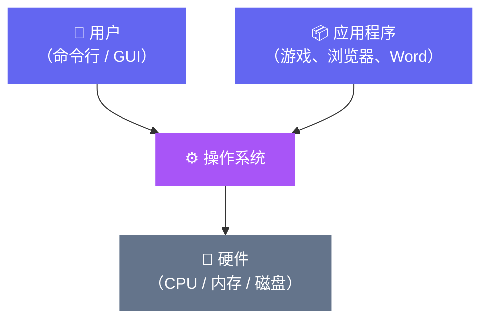
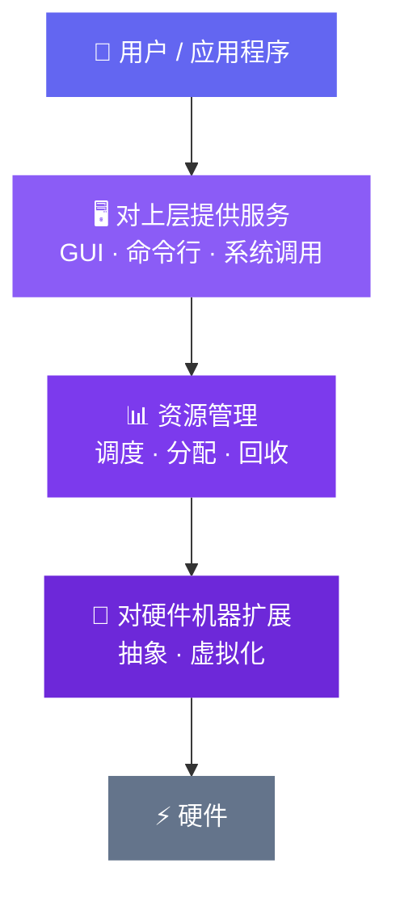

# 1.1 操作系统的概念与功能

操作系统是什么？课本给出一个听起来很官方的定义，但我觉得先从感受出发比较好——

你打开电脑，双击一个游戏图标，游戏跑起来了。这背后发生了什么？你的鼠标点击被识别，图标被找到，可执行文件被加载进内存，CPU 开始执行游戏代码，显卡开始渲染画面，声卡开始播放音效……这一切你什么都没做，**有人替你协调了一切**。

这个"有人"，就是操作系统。

---

## 操作系统的本质：夹在中间的那一层

从计算机的整体结构来看，软件世界可以分成几层：



操作系统住在硬件和应用程序之间，向下管理硬件，向上服务软件和用户。它本身是一种**系统软件**，但它跟普通软件不一样——普通软件（Word、Chrome）是在操作系统上跑的，操作系统是让普通软件能跑起来的那个前提。

📖 **概念：操作系统的教科书定义**

《操作系统概念》（第9版）给出这样的定义：

> 操作系统是一个程序，它充当计算机硬件与计算机用户之间的**中介**。操作系统的目标是：提供一个方便用户执行程序的环境，以及使计算机硬件得到有效使用。

这里有两个关键词：**方便**（对用户友好）和**有效**（让硬件不闲着）。这两个目标有时候会产生矛盾——给用户做一个好看的 GUI 界面消耗资源，但让服务器跑得更快就要尽量少做界面。这也是为什么 Windows 和 Linux 服务器版的设计哲学完全不同。

---

## 操作系统的三大功能

你说得很对，操作系统的功能可以从三个角度来看。但我来把它们梳理得更清晰一点。

### 功能一：资源的管理者

计算机里有各种硬件资源：

| 资源类型 | 例子 |
|---|---|
| 处理器资源 | CPU（谁来用、用多久） |
| 内存资源 | RAM（给哪个程序分配多少内存） |
| 存储资源 | 硬盘、SSD（文件怎么存、怎么找） |
| I/O 资源 | 键盘、鼠标、网卡、打印机 |

这些资源是**有限的、共享的**。你同时开着微信、浏览器、音乐播放器，它们都想用 CPU，都想用内存——但 CPU 只有那么几个核，内存只有那么多 GB。

操作系统就是**资源的管理者和仲裁者**：决定谁先用、用多少、用多久，出了冲突怎么解决。

📖 **类比：操作系统像一个图书馆管理员**

图书馆里的书（资源）是有限的。管理员负责：
- 借书登记（记录谁在用哪个资源）
- 排队等候（多个人想借同一本书）
- 到期归还（资源用完要释放）
- 防止损坏（一个程序不能乱改另一个程序的内存）

没有管理员，大家一哄而上，书很快就乱套了——这就是没有操作系统时裸机的状态。

### 功能二：对上层提供服务

你说到了一个很好的历史背景——早期没有操作系统时，程序员要直接对机器输入二进制指令（开关打孔卡片）。那种体验确实痛苦：

```
0001 0000 0000 0011   ← 这是一条机器指令，让 CPU 把内存地址 3 的值读进寄存器
```

写一个"打印 Hello World"可能要几百条这样的指令。更糟的是，不同机器的指令集不同，给 A 机器写的程序完全没法在 B 机器上跑。

操作系统把这些底层细节包起来，对外提供了两类接口：

**第一类：给普通用户的接口（命令接口）**

直观来讲就是"怎么操作这台电脑"，分两种：

- **图形用户界面（GUI）**：你现在用的 Windows、macOS。用鼠标点图标，拖拽文件，所见即所得。GUI 的普及要感谢 1984 年苹果的 Macintosh（对，不是 Windows，苹果先做的）。

- **命令行接口（CLI）**：`cmd`、PowerShell、Linux 的 bash。你直接输入文字命令。

  命令行还分两种：

  | 类型 | 特点 | 例子 |
  |---|---|---|
  | **联机命令接口** | 输一条、执行一条，等结果再输下一条 | 你在 cmd 里手动输命令 |
  | **脱机命令接口** | 提前写好一堆命令，一次性执行 | `.bat` 脚本、Shell 脚本、Linux 的 `&` 后台执行 |

  你说脱机命令"就是脚本"——这个理解基本对，批处理脚本就是典型的脱机命令接口。

**第二类：给程序员和软件的接口（程序接口）**

这就是你说的 **API（Application Programming Interface，应用程序编程接口）**，更准确地说是**系统调用（System Call）**。

当你的 C 程序调用 `printf("hello")` 时，最终会触发一个叫 `write` 的系统调用，通知操作系统"帮我把这串字符写到屏幕"。操作系统才是真正和硬件对话的那一层，你的程序只是"发请求"。

📖 **概念：系统调用是什么**

系统调用是应用程序和操作系统之间的"受控入口"。说"受控"是因为：程序**不能直接访问硬件**，必须通过系统调用向操作系统提出请求，由操作系统代劳。

这种设计的好处是**安全**——如果程序可以直接写任意硬件，一个恶意程序就能把你的硬盘格式化。通过系统调用，操作系统可以审查每个请求是否合法。

系统调用会在第六小节单独细讲，这里先知道它的存在就行。

### 功能三：对硬件机器的扩展（虚拟机的思想）

你那个汽车的比喻太好了，我来保留并扩展一下。

你买了一辆车，车里有发动机、变速箱、刹车系统、转向系统……几千个精密零件。但暴露给你的只有：方向盘、油门、刹车踏板、换挡杆。**复杂的机械被封装成了简单的操作界面**。

计算机也是一样。一台刚出厂的电脑——我们叫它**裸机**——里面有 CPU、内存条、硬盘、显卡、网卡。但 CPU 只会执行二进制指令，内存只是一堆可以读写的格子，硬盘只是一个存字节的磁性盘片。它们各自的"能力"非常单一和底层。

**操作系统把这些单一的硬件能力组合、封装、扩展**，向上呈现出更高级的抽象：

| 硬件原始能力 | 操作系统抽象后 |
|---|---|
| 内存：一堆可读写的字节 | 进程地址空间：每个程序有自己的"私有内存" |
| 硬盘：按扇区读写数据 | 文件系统：用文件名访问数据 |
| CPU：执行指令 | 进程/线程：多个程序"同时"运行的幻觉 |
| 网卡：收发以太网帧 | Socket：程序直接发字符串就能联网 |

这就是为什么装了操作系统的计算机被称为**虚拟机（Extended Machine）**——它是在裸机基础上，由操作系统"虚拟"出来的一台更好用的机器。

📖 **概念：封装思想在软件里无处不在**

你说到封装思想，这是对的。操作系统是封装最典型的例子，但在整个计算机科学里这种思想贯穿始终：

- 汇编语言封装了机器码
- C 语言封装了汇编
- 操作系统封装了硬件
- 应用程序封装了操作系统调用
- 网站封装了底层网络协议

**每一层只需要知道下一层提供了什么，不需要关心下一层怎么实现的**——这就是计算机科学最重要的设计原则之一：**抽象（Abstraction）**。

---

## 三大功能的关系

三个功能不是相互独立的，而是相互支撑：



- 没有"封装层"，上面两层就没有基础
- 没有"管理层"，多个程序争抢资源就会乱
- 没有"接口层"，用户和程序员就没法使用前两层的成果

---

## 本节小结

| 功能 | 一句话概括 | 关键词 |
|---|---|---|
| 资源管理者 | 协调有限资源的使用 | 调度、分配、保护 |
| 对上层提供服务 | 让人和程序能方便地使用电脑 | GUI、命令行、系统调用 |
| 对硬件机器扩展 | 把裸机变成好用的虚拟机 | 封装、抽象 |

下一节会讲操作系统的**四个特征**——并发、共享、虚拟、异步。这四个特征其实都是从"资源管理"和"对上层服务"这两个功能里生长出来的。
