# 1.2 操作系统的特征

上一小节我们讲了操作系统的概念和功能，也就有了初步的对操作系统的认识，但是还远远不够。这一节我们将深入到操作系统的特性上去分析，从而明白操作系统到底有着什么样的特点以及缺点，这些特性对于未来从事相关项目以及学习的朋友绝对至关重要。所以我们就直接开始。
 
操作系统的特征一共有四个：**并发性 / 共享性 / 虚拟性 / 异步性**
 
它们之间并不是平起平坐的关系——并发和共享是最基本的两个特征，虚拟和异步都以这两者为基础：
 
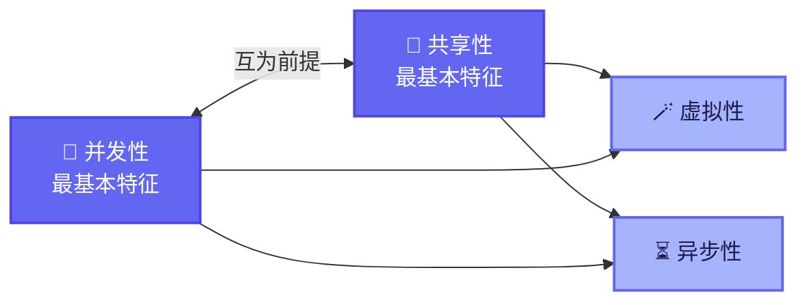
 
---
 
## 一、并发性
 
这是操作系统最重要的特性，我们得先了解这么几个概念的区别：并发 / 并行和串行。
 
**并发**：宏观上"多个任务一起跑"，微观上是 CPU 在快速切换 / 交替执行。需要注意，并发是在**单处理机**环境下实现的"假同时"。
 
**并行**：一般来说是两个或多个任务同一时刻真正同时发生，需要**多处理机**环境支撑。
 
**串行**：就很简单，先做完 A 任务再去做 B 任务，做完 B 任务再去做 C 任务，如果在某一个任务上卡死，那后面的任务就要排队了。
 
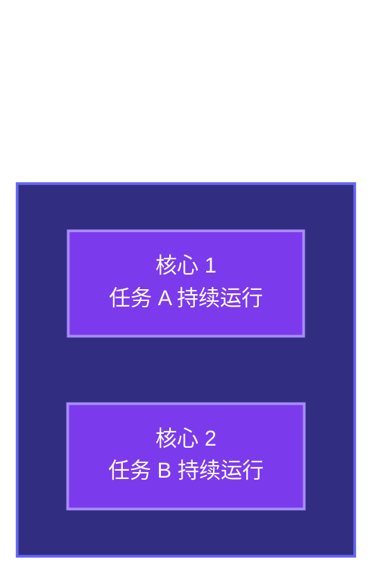

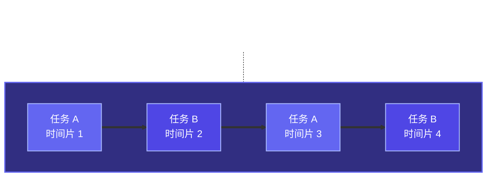

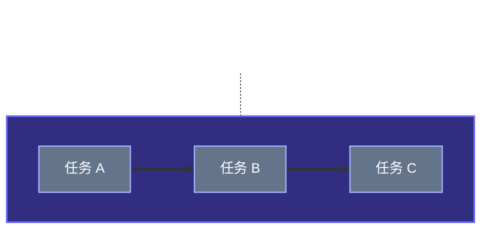
 
在明白了这几个概念之后，我们要讲清楚并发性就会容易得多。在计算机发展的早期历史里（后面第三小节我们也会讲到），早期计算机实际上是没有并发这样性质的，是单纯的串行。像第一代的大型机 / 真空管计算机，一次只能跑一个程序，所有设备资源，包括 CPU / 内存 / 外设全部被一个任务占领。
 
虽然我们知道 CPU 肯定是快的，但是键盘，打印机，磁盘，磁带这样的外设，同时在这样一个进程里参与，他们的时间相比于 CPU 就很慢。举个例子，如果 CPU 要算 1 秒钟，但等到打印机打印结果，从磁盘里读取数据等等操作却需要数十秒。这样的情况就会导致 CPU 在这些无用的时间内要空转 / 发呆，硬件资源就被浪费了。所以后来人们又发明了批处理系统，直到最关键的进步——多道程序设计的诞生，这样的问题才终于得到了一定的解决，并出现了并发性。也就是说，并发性本身是结构性的，这种结构性将会引起我们对整个系统乃至功能的设计，所以说它至关重要。
 
当然了，可能还是有的朋友不太理解什么是并发和并行，对于宏观与微观可能也有一些疑惑。那我们不妨做一个生活化的比喻。
 
我有一个朋友，他叫小李，是一个情场老手。很受女孩子的欢迎。有一天，有个女孩子 A 约他出来玩，他欣然答应，但正在收拾着装、准备出发的时候，突然另一个女生 B 的微信电话打了进来，问他什么时候见面，他这才想起来原来昨天已经约好了人，这就让他感到发愁了，两个女孩子都很漂亮，而且他已经都答应好人家了，该怎么办呢？
 
此时出现了两个任务。任务1：和女生 A 约会；任务2：和女生 B 约会。
 
搁别人估计起码要拒绝一个吧。但小李不愧是高手，于是跟两个女生沟通了自己的情况，决定把两个女孩约到一起，三个人一起约会。这么逆天的要求，两个女孩竟然没有拒绝，可能是因为小李长得帅吧。
 
于是就出现了诡异的一幕：小李同时在跟女生 A 和女生 B 一起同一时刻同时约会。此时呢，我们称这样的情况就是"**并行**"。
 
但是这毕竟有些太诡异了不是，所以小李作为情场老手，果断化身"时间管理大师"，想出了另一套方案。
 
方案如下：
- 8:00 ~ 9:00：和女生 A 约会
- 9:00 ~ 10:00：和女生 B 约会
- 10:00 ~ 11:00：和女生 A 约会
- 11:00 ~ 12:00：和女生 B 约会

这样呢，小李就不会陷入很尴尬的境地了。拿这种情况，在宏观上来说，是同一天发生的，在微观上来说，两个任务是交替进行的。这就叫"**并发**"。
 
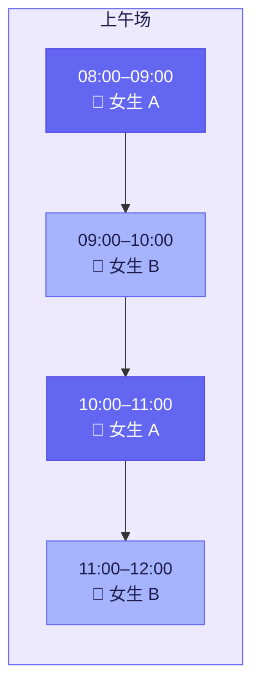
 
当然我仅仅只是举了一个例子，无性别歧视，无论对于男生还是女生来说，出轨或者是滥情都是不被允许的。（正能量）
 
回到操作系统中来说，操作系统的并发性是指在计算机系统里"同时"运行着多个程序，宏观上看是同时运行着的，而微观上看则是交替运行的。之前我们已经说过了，这种并发性源自于"多道程序技术"的出现。这一点在下一节我们就会讲到。
 
但是要注意一点，并发性在不同的硬件设备上，并发的效果也是不同的：
 
- 单核 CPU 同一时刻只能执行一个程序，各个程序只能并发地执行
- 多核 CPU 同一时刻可以同时执行多个程序，多个程序可以并行地执行，但是此时如果有多个程序争抢同一个核，那就还是会出现针对这个核的并发情况
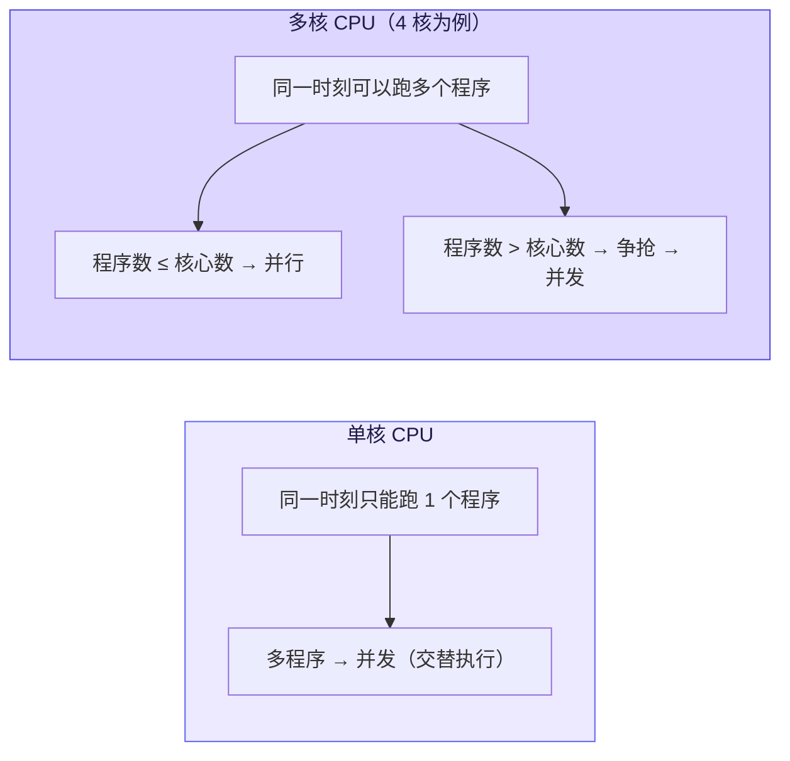
 
再举个例子，比如英特尔的第八代 i3 处理器就是 4 核 CPU，意味着可以并行地执行 4 个程序。如果我使用这样的电脑，并需要同时使用微信 / QQ / WPS / Chrome 这四款软件，对于一个有四个核的电脑来说，它可以将这四个程序以及每个程序下辖的任务分别分到四个核里，那么对于这四个程序而言，此时运行就是并行的。但如果我突然之间想要听歌，于是我打开了网易云音乐，那此时这种微妙的平衡就被打破了，网易云音乐可能就会跟微信争抢对于一个核的运行权，此时两个程序围绕一个核会在宏观意义上同时运行，但微观上他们实际是交替运行的，这就是并发性。
 
---
 
## 二、共享性
 
共享即资源共享，是指系统中的资源可供内存中多个并发执行的进程共同使用。这个资源上一节我们已经说过了，但是对资源的共享其实也没有那么简单，基本上也分成两种共享形式：
 
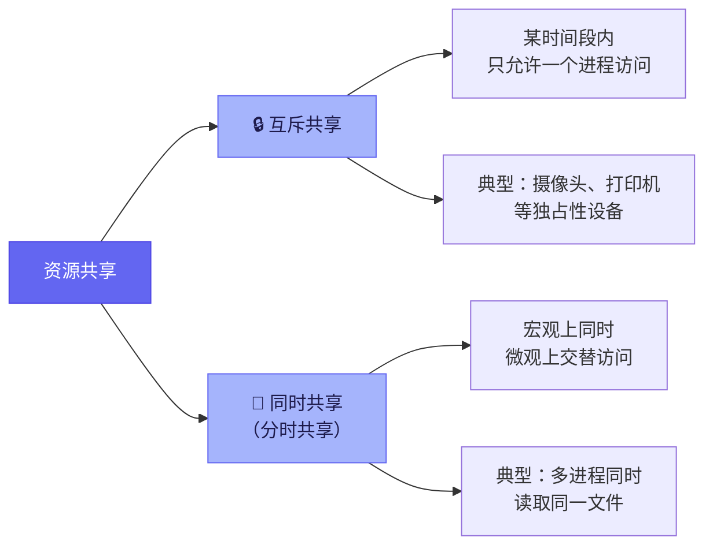
 
第一种是**互斥共享方式**，在这种情况下，系统中的某些资源，虽然可以提供给多个程序使用，但是某一时间段内，只允许一个程序使用。它使用完，其他程序才可以一个接一个使用。
 
第二种则是**同时共享方式**，也就是说会有某些资源，"同时"地被多个程序在同一时间段内进行访问和使用。一般来说这种"同时"本身还是宏观意义上的，而在微观意义上，还是并发性的，即交替性的访问同一资源（分时共享）。
 
举个例子，比如我同时打开了 QQ 和微信，但是此时有两个人同一时刻给我打来了 QQ 视频电话和微信视频电话，我如果选择同时接听，但是摄像头只有一个，所以只有一个通话可以被接听，另一个可能就会因为无法使用摄像头而被中断。这就是**互斥共享**。
 
比如有 50 个同学同时在访问学校教务系统查询成绩单，底层实际上是 50 个进程在交替地读取服务器磁盘上同一份数据库文件。宏观上大家"同时"在用，微观上是分时交替读取。这就是**同时共享**。
 
当然值得注意的是，微观上有的时候不只有交替进行的并发性，真的有可能会真正意义上的同时进行两个程序，比如我在打游戏的时候同时打开了网易云音乐，这样我的耳机里就会同时有游戏声和音乐声同时进行，当然了，可能会有点吵，所以我自己是不喜欢一边打游戏一边听音乐的。
 
所以看到这里其实你就会发现，共享性的本身特点就是并发性，如果没有并发性，共享性就无从谈起，如果没有共享性这一外在表现，那实际上就意味着此时这个设备无法并发。
 
---
 
## 三、虚拟性
 
虚拟是指把一个物理上的实体变为若干个逻辑上的对应物。物理实体（前者）是实际存在的，而逻辑上对应物（后者）是用户感受到的。这一定义我觉得实在是相当准确了，只有理解了这一定义，你才能明白计算机专业下的虚拟、逻辑等词语是什么含义。
 
实现虚拟的技术手段，核心是两种复用方式：
 
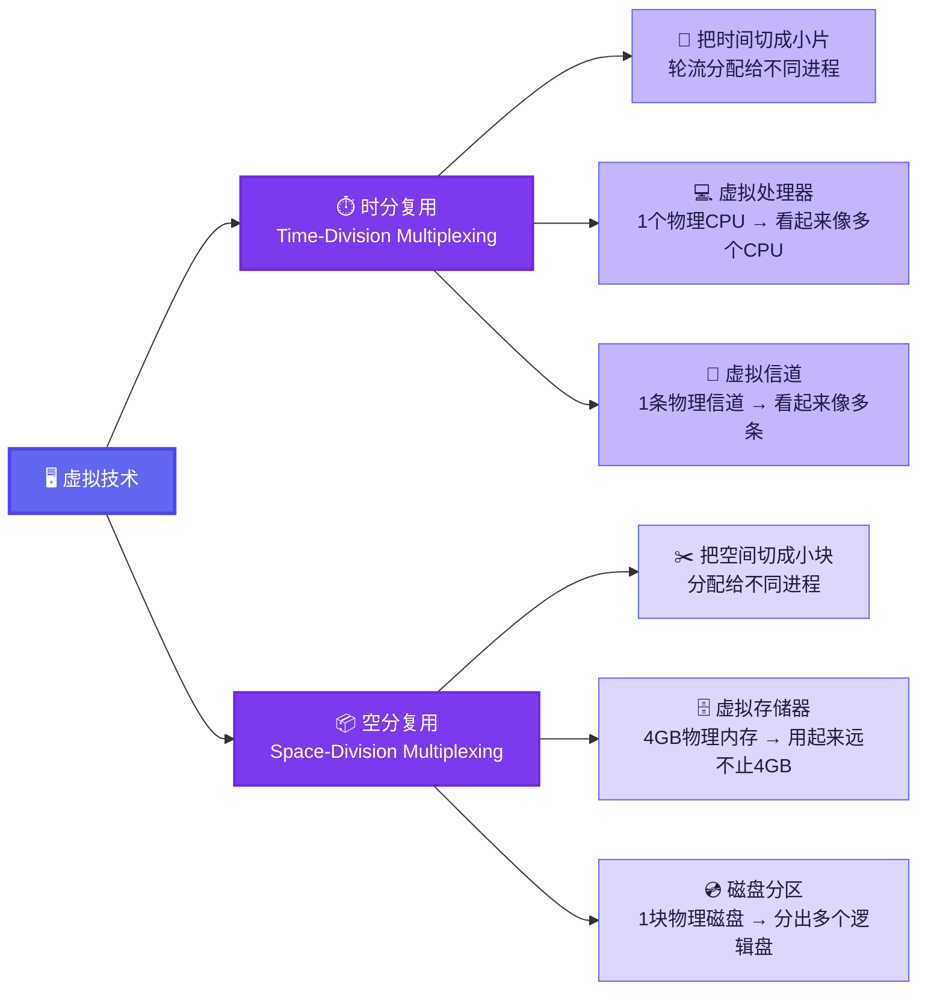
 
### 虚拟存储器：空分复用
 
同样举个例子，比如我有一台电脑的实际物理内存是 4GB，但是这台电脑上却装了英雄联盟 / QQ / WPS / 网易云音乐等软件，英雄联盟需要 4GB 的运行内存，QQ 需要 256MB 的内存，WPS 需要 512MB 的内存，网易云音乐要 256MB 的内存。但我的电脑只有 4GB 的内存啊，我怎样才能保证这些程序在我的电脑上同时运行呢？
 
这里实际上使用到了一种叫"虚拟存储器技术"中的"**空分复用技术**"。
 
空分复用的核心思路是：把物理内存的空间切块分配，同时借助磁盘做"后备仓库"，把暂时用不到的内容换出去、需要的时候再换回来。每个进程都"以为"自己独享着一大块连续的内存，但物理上这些空间是被操作系统精心调度、拼凑出来的。
 
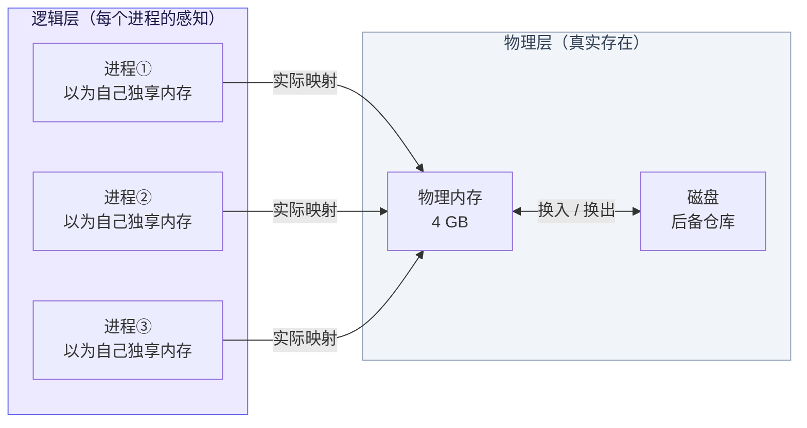
 
### 虚拟处理器：时分复用
 
而我这台电脑又是一颗单核 CPU 的计算机，如果我打开了以上四个软件。那按理来说，我的电脑中就不可能同时运行这么多个程序？因为这就相当于 4 个 CPU 在同时为自己服务，但是电脑的确奇迹般地同时在正常运行这些程序，让我感觉就好像我的这台单核处理器电脑瞬间变成了拥有 4 个核的电脑。
 
这里使用到的是"虚拟处理器技术"中的"**时分复用技术**"。实际上只有一个单核 CPU，在用户看来似乎有 4 个 CPU 在同时为自己服务。本质上是微观上处理机在各个微小的时间段内交替着为各个进程服务。这种微小的程度已经几乎让你感觉不到任何的卡顿出现，但本质上还是并发的。
 
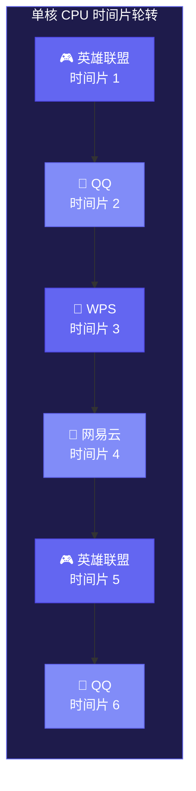
 
物理上只有 1 个 CPU，但用户感知到的是"4 个程序都在跑"——这就是**虚拟处理器（Virtual Processor）**，时分复用的典型应用。
 
> 时分复用不只用在 CPU 上。网络通信里也有：一条物理信道通过时分复用可以同时传输多路通话，这就是我们打电话时底层在做的事。同样，空分复用也不只用在内存上——你电脑上的 C 盘、D 盘，本质上可能都在同一块物理硬盘里，只是被逻辑分区划出来的，这也是空分复用。
 
---
 
## 四、异步性
 
异步性是指，在多道程序环境下，允许多个程序并发执行，但由于资源有限，进程的执行不是一贯到底的，而是走走停停，以**不可预知的速度和顺序**向前推进，这就是进程的异步性。
 
这里的核心是"不可预知"——不只是走走停停，而是你根本不知道它什么时候停、停多久、以什么顺序推进。
 
这里我不得不再次提到我的好朋友小李了，因为他的经历实在是太过炸裂但是放在这个概念讲解里又是这么的恰当。
 
小李要跟两个女孩进行"并发性"的约会。
 
此时我们不妨将小李看成是设备资源，而女生 A 和女生 B 则看成是两个程序。此时呢有如下情况：
 
- A 的指令1：小李陪我吃饭
- A 的指令2：小李把心给我
- B 的指令1：小李把心给我
- B 的指令2：小李陪我吃饭

那此时小李面对一天当中同时进行的两场约会。按照"并发性"的开展，小李将作如下部署：
 
**方案一：**
- 8:00 ~ 9:00：和女生 A 吃饭
- 9:00 ~ 10:00：小李把心给女生 A
- 10:00 ~ 11:00：小李把心给女生 B
- 11:00 ~ 12:00：和女生 B 吃饭

那么在这种情况下，小李的心就是系统资源当中的有限资源，也就是只能互斥共享，如果在 10:00 结束后，女生 A 仍然没有把小李的心归还给小李，那么女生 B 的约会就没有办法在 10:00 准时开展，在我们的电脑中，这种情况叫**阻塞**。
 
**方案二：**
- 8:00 ~ 9:00：和女生 A 吃饭
- 9:00 ~ 10:00：小李把心给女生 B
- 10:00 ~ 11:00：小李把心给女生 A
- 11:00 ~ 12:00：和女生 B 吃饭

那么在这种情况下，实际上也是一样的，如果在 10:00 结束后，女生 B 仍然没有把小李的心归还给小李，那么女生 A 的约会就没有办法在 11:00 准时结束，此时两个程序都处于阻塞状态。
 
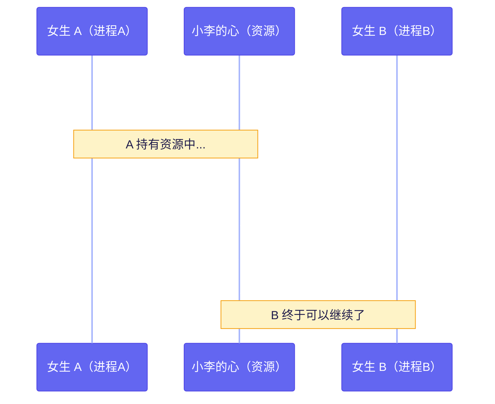
 
所以说这场约会不管以何种方式进行，都会是走走停停的，以一种不可预测的方式进行下去。当然，这种延迟以及故障，实际上在现实生活当中出现的概率很少，但是在数以千万级的程序指令中，出现问题的概率还是很大的。所以这种异步状态该如何处理，我们后面也会讲到。但是异步性你会发现本质上还是并发性的一个外在表现。
 
---
 
## 总结
 
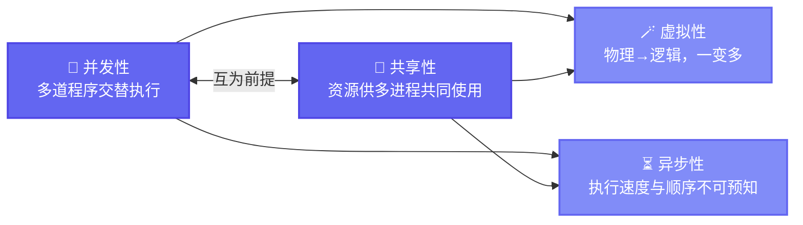
 
四大特征不是孤立的标签，它们是一套相互支撑的系统：并发和共享撑起了地基，虚拟让资源"看起来更多"，异步则是这一切运转起来之后不可避免的"副产品"。理解了这四个特征，你就理解了操作系统为什么要这么设计——后面讲进程、内存管理、文件系统，都能从这里找到源头。