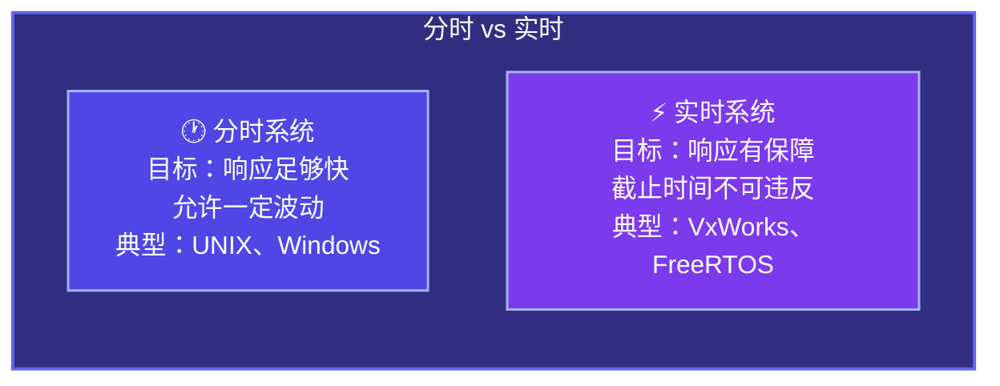
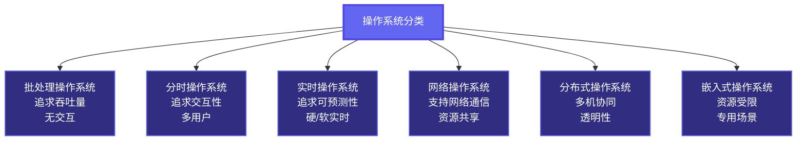

# 1.3 操作系统的发展与分类

上一节我们讲了操作系统的四大特征，知道了并发、共享、虚拟、异步这一套东西是怎么来的。但有一个问题我们一直没有正面回答：操作系统本身是怎么一步一步进化成现在这个样子的？它为什么要这样设计？

这一节我们就来捋一捋这条进化链。理解了历史，你才能理解为什么现代操作系统长成这样——每一个设计决策背后都有它要解决的历史问题。

---

## 一、手工操作阶段（无操作系统）

时间线拉到上个世纪 40 年代末到 50 年代初。那个时候计算机还是个庞然大物，一台机器能占满整个房间，用的是真空管，程序员需要亲自去机房"伺候"这台机器。

具体怎么操作呢？程序员先把程序打在穿孔纸带或者打孔卡片上，然后亲手把这个纸带喂给计算机，等计算机跑完，再亲手取走结果。整个过程全靠人工，没有任何自动化可言。

这带来了一个很严重的问题：**CPU 利用率极低**。

原因很简单——人是慢的，机器是快的。程序员在换纸带、调参数、取结果的这段时间里，CPU 就只能干坐着等。而且这台机器在某个时间段内只能被一个人独占，其他人排队等。这种模式下，CPU 一天能真正"干活"的时间少得可怜。

这个阶段有个很有代表性的缺点，叫**人机矛盾**：CPU 的速度和人工操作的速度差了好几个数量级，资源严重浪费。

---

## 二、批处理阶段

人们意识到，既然人工操作是瓶颈，那能不能让机器自动连续地处理一批任务，中间不需要人介入？

于是**批处理系统**诞生了。

### 单道批处理系统

最早的批处理思路很朴素：把一堆作业（程序）打包成一批，交给一个叫**监督程序**（Monitor）的东西管理，让它自动一个接一个地跑，不需要人在旁边守着。

这比手工操作强多了——CPU 不用再等人换纸带了，作业与作业之间的切换是自动的。但还有一个问题没解决：**CPU 还是要等 I/O**。

举个例子，程序在从磁盘读数据的时候，CPU 就只能闲着——因为系统里同一时刻只有一道程序在跑，I/O 不完成，程序就没法继续。这和手工操作阶段的本质矛盾是一样的，只不过瓶颈从"等人"变成了"等设备"。

**单道批处理的核心特点**：自动性、顺序性、单道性。内存里任何时刻只有一道程序，资源独占，但 CPU 利用率依然不高。

### 多道批处理系统

这就引出了一个更聪明的想法：既然 CPU 在等 I/O 的时候是闲的，能不能趁这个空档，让 CPU 去跑另一道程序？

**多道批处理系统**就是干这个的——在内存里同时放多道程序，当一道程序因为等 I/O 而阻塞的时候，操作系统自动把 CPU 切给另一道程序。CPU 的利用率一下子就上去了。

这就是我们上一节讲的**并发性**的起源。

但多道批处理也有自己的缺点：**没有交互性**。你把作业提交上去，就只能等结果，中间根本没办法跟程序互动。如果程序跑到一半出了问题，你也不知道，只能等它跑完才发现结果不对。

---

## 三、分时操作系统

批处理的交互性问题让程序员很痛苦。程序员写代码、调试，是需要实时反馈的——改一行代码，马上想看结果，而不是提交上去等几个小时。

于是**分时操作系统**出现了。

核心思想非常简单：把 CPU 的时间切成很小的片段（时间片，Time Slice），轮流分给每个用户的终端。每个用户感觉上好像自己独占了一台机器，但实际上大家在共用同一个 CPU。

这就是上一节讲的**时分复用**在操作系统层面的直接应用。

分时系统的三个关键特性：

- **多路性**：多个用户同时使用一台计算机
- **交互性**：用户可以通过终端与系统进行实时对话
- **独立性**：每个用户感觉自己在独立使用计算机，互不干扰
- **及时性**：用户的请求能在足够短的时间内得到响应（响应时间一般在几秒以内）

UNIX 就是分时系统的典型代表，现代操作系统基本上都继承了分时系统的核心设计思路。

---

## 四、实时操作系统

分时系统解决了交互性问题，但还有一类场景它搞不定：**对时间有严格要求的任务**。

比如导弹控制系统、飞机飞行控制系统、工厂的自动化生产线——这些场景里，"及时响应"不只是"用户体验好不好"的问题，而是生死攸关的硬性要求。如果导弹控制系统响应慢了 0.1 秒，结果可能是灾难性的。

**实时操作系统（RTOS）** 就是为这类场景设计的，它有两个变种：

- **硬实时系统**：必须在规定时间内完成任务，错过截止时间就是系统失败。导弹、心脏起搏器、工业控制属于这类。
- **软实时系统**：尽量在规定时间内完成，偶尔超时可以接受，但不能太过分。流媒体播放、在线游戏属于这类。

实时系统和分时系统最大的区别在于**设计目标不同**：分时系统追求的是响应时间足够短、用户感觉流畅；实时系统追求的是响应时间有保障、绝对可预测。

---

## 五、现代操作系统的分类

讲完历史，我们来做个横向的分类总结。现代操作系统按照用途和特性，大致可以分成这几类：

几个值得多说一句的：

**网络操作系统**：支持网络功能，让不同机器上的用户能共享资源，但各台机器依然保持自己的独立性，用户是知道自己在访问"另一台机器"的。Windows Server 就是典型例子。

**分布式操作系统**：比网络操作系统更进一步——它把多台计算机整合成一个整体，用户感知不到自己在和哪台机器打交道，系统对外表现得像一台机器。这种"透明性"是分布式系统最核心的特征，也是它最难实现的地方。

**嵌入式操作系统**：跑在资源极度受限的硬件上，比如路由器、智能手表、汽车的 ECU。代码体积小、实时性要求高，很多还需要可裁剪——用不到的功能直接删掉，不占资源。FreeRTOS、RT-Thread 都是这类的代表。

---

## 总结

操作系统的每一次进化，都是在回应一个具体的痛点：手工太慢→批处理；等 I/O→多道；没法交互→分时；不够可预测→实时。这条进化链背后的逻辑非常清晰，理解了它，后面讲进程调度、内存管理这些机制的时候，你会知道这些东西是从哪里来的，要解决什么问题。