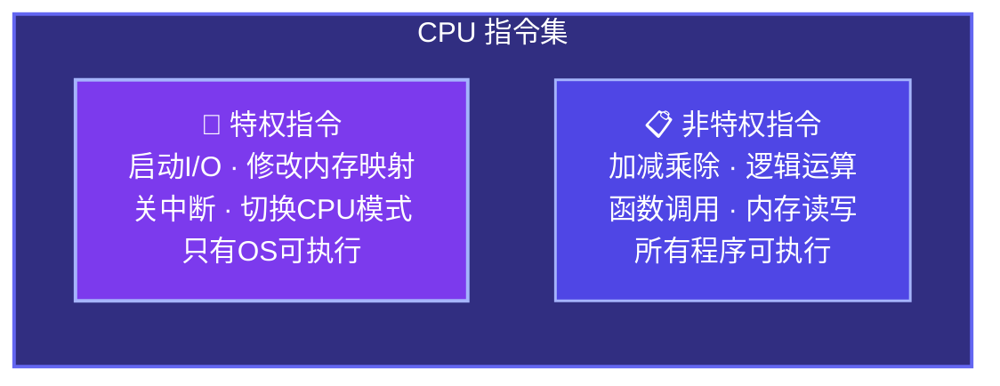
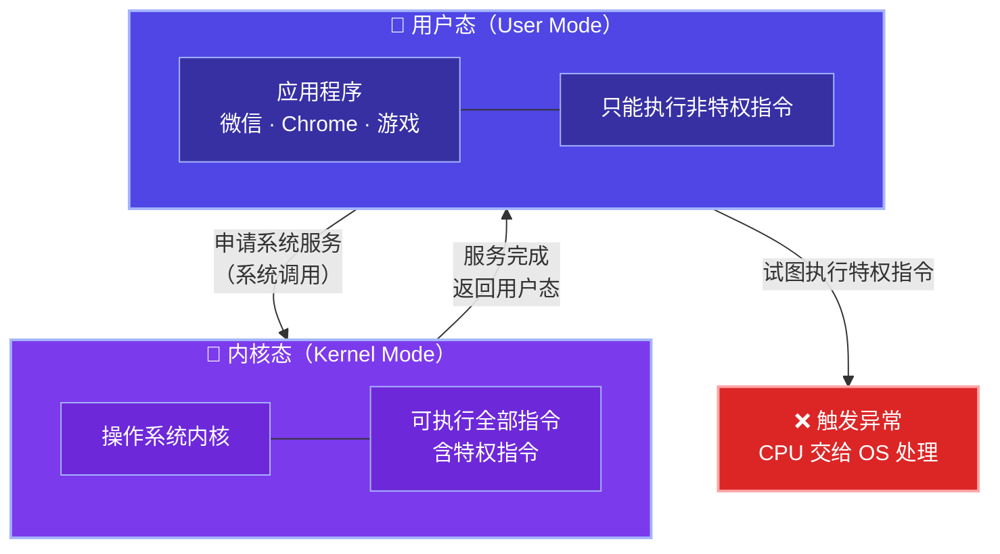
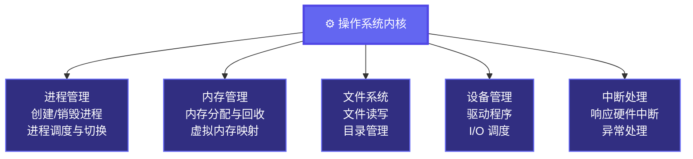
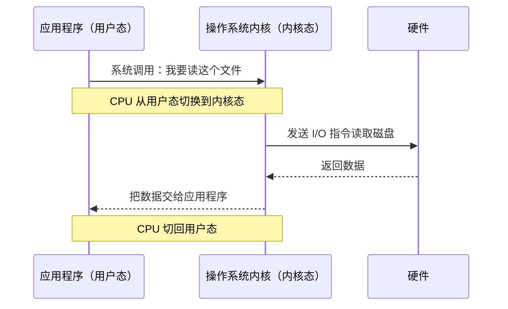
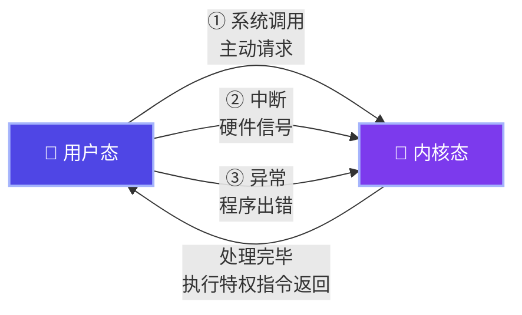
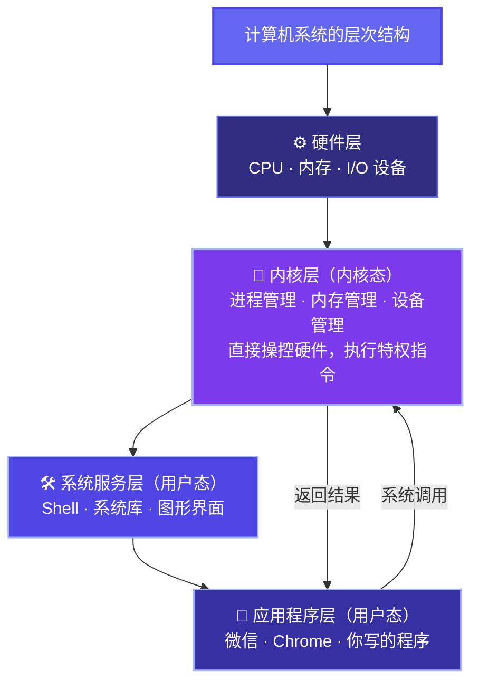

# 1.4 操作系统的运行机制

前面几节我们一直在讲操作系统"是什么"、"有什么特征"、"怎么发展来的"。但有一个问题我们从来没有正面碰过：操作系统本身是怎么跑起来的？它凭什么能管住其他程序？它和普通程序有什么本质区别？

这一节就来回答这个问题。这是整个操作系统课程里非常基础、但也非常容易被忽视的一节——很多人学了一学期 OS，依然说不清楚"内核态"和"用户态"到底是什么意思。

---

## 一、两种指令：特权指令与非特权指令

我们先从 CPU 能执行的指令说起。

CPU 能执行的机器指令，并不是平等的——有些指令很"危险"，如果让所有程序随便执行，系统就会乱套。比如直接操作硬件、修改内存映射、关闭中断……这些指令一旦被恶意程序或者写错的程序随便调用，整个系统就完了。

所以 CPU 的设计者把指令分成了两类：

- **特权指令**：只有操作系统才能执行的指令。比如启动 I/O 设备、修改程序状态字、设置时钟、关中断等等。普通程序想执行这些？不行，CPU 直接报错。
- **非特权指令**：普通程序可以随便用的指令。加减乘除、逻辑运算、跳转、调用函数……这些都没问题。

这就像一栋大楼里，有些房间是"员工专属"，用的是特殊钥匙，普通访客根本进不去。有些走廊和大厅则是公共区域，谁都能去。

---

## 二、两种状态：内核态与用户态

光把指令分类还不够，CPU 还需要一个机制来**执行时判断当前程序有没有资格执行特权指令**。

这个机制就是 CPU 的运行状态，也叫**处理机状态**，分两种：

- **内核态**（Kernel Mode，也叫管态、特权态）：CPU 处于这个状态时，可以执行**所有指令**，包括特权指令。操作系统内核运行在这个状态。
- **用户态**（User Mode，也叫目态）：CPU 处于这个状态时，只能执行**非特权指令**。普通应用程序运行在这个状态。

CPU 里有一个专门的标志位来记录当前处于哪种状态。如果处于用户态的程序试图执行特权指令，CPU 会立刻产生一个**异常**，把控制权交给操作系统来处理——通常是直接把这个程序干掉。

我来讲个故事帮你理解。

我们学校食堂有一个规矩：普通同学（用户态）只能在打饭窗口买饭，不能进后厨；食堂大师傅（内核态）才能进后厨操作灶台、菜刀、大锅这些"危险设备"。

有一天，某个饿坏了的同学觉得排队太慢，想直接冲进后厨自己炒菜（普通程序试图执行特权指令）。保安（CPU 的状态检查机制）立刻拦住了他，请他出去（触发异常，操作系统接管）。不管他饿成什么样，这个规矩不能破——因为如果谁都能进后厨乱操作，食堂早就炸了。

---

## 三、内核是什么

说了这么多"操作系统内核"，到底什么是内核？

**内核（Kernel）** 是操作系统中最核心、权限最高的那一部分代码，运行在内核态。它直接管理硬件，负责最底层的资源调度。

但"操作系统"这个词范围比"内核"要大——操作系统除了内核之外，还有一些运行在用户态的系统程序，比如 Shell（命令行界面）、图形界面、系统库等等。

内核具体负责哪些事？主要有这几块：

---

## 四、两种程序：内核程序与应用程序

有了内核态和用户态的概念，我们可以很自然地把计算机里跑的程序分成两类：

- **内核程序**：运行在内核态，构成操作系统的核心，可以执行特权指令，直接操控硬件。
- **应用程序**：运行在用户态，不能直接碰硬件，需要通过系统调用请求操作系统帮忙。

这里有个关键问题：**应用程序如果想做一件"需要特权"的事情，比如读写文件、发送网络数据包，它应该怎么办？**

答案是**系统调用**（System Call）——应用程序向操作系统发出请求，操作系统在内核态帮它完成这件事，完成之后再把控制权还给应用程序。

这就好像食堂的例子：同学（应用程序）想吃一道需要用大锅炒的菜，他没法自己进后厨，但他可以在窗口点菜（系统调用），大师傅（操作系统内核）在后厨帮他做好，再端出来给他。整个过程对同学来说是透明的，他不需要知道后厨怎么运作。

---

## 五、状态之间怎么切换

内核态和用户态不是一成不变的，它们之间会来回切换。切换的触发条件有三种：

**用户态 → 内核态**（需要操作系统介入）：
1. **系统调用**：应用程序主动请求操作系统服务，比如 `read()`、`write()`、`fork()`
2. **中断**：外部硬件产生的信号，比如键盘按下、磁盘 I/O 完成、时钟中断
3. **异常**：程序执行中发生了错误，比如除以零、非法内存访问、执行特权指令

**内核态 → 用户态**：
- 操作系统处理完毕，通过执行特权指令修改 CPU 状态标志位，返回用户态

这三种触发方式里，**系统调用**是应用程序主动发起的，是"我需要你帮忙"；**中断**是硬件主动打断 CPU 的，是"有事发生了你来处理"；**异常**是程序自己出了问题，是"这里出错了你来收拾"。

这三者的区别我们在下一节（1.5 中断与异常）里会详细展开。

---

## 总结

这一节的核心就是两对概念：**特权指令 vs 非特权指令**，**内核态 vs 用户态**。它们是操作系统能够"管住"所有程序的根本原因——不是靠道德约束，而是靠 CPU 硬件层面的强制隔离。

理解了这个，下一节讲中断与异常，你就会知道这套机制是怎么被触发、怎么运转起来的。