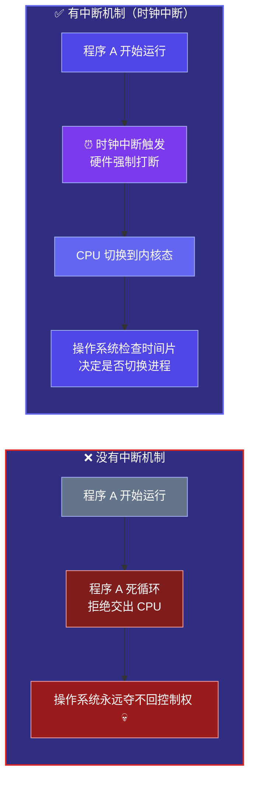
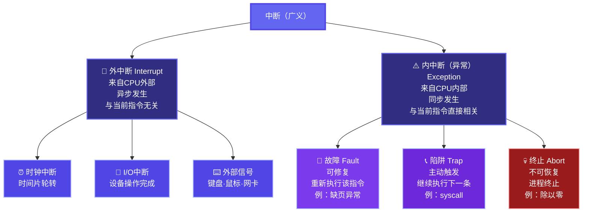
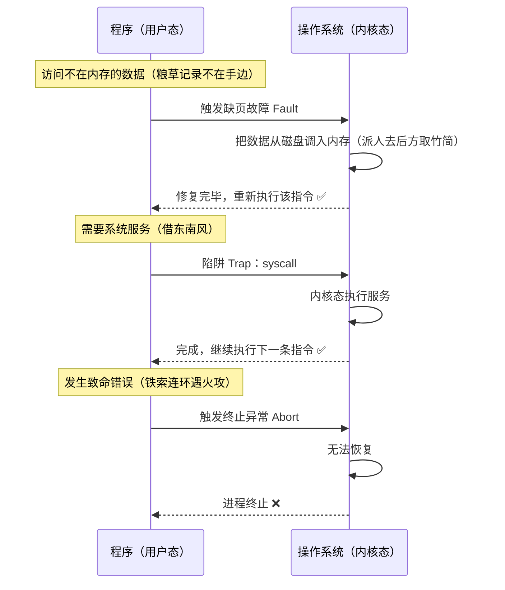
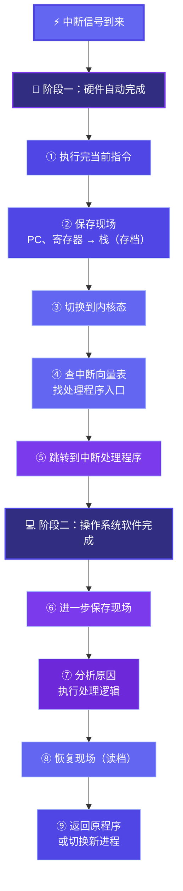
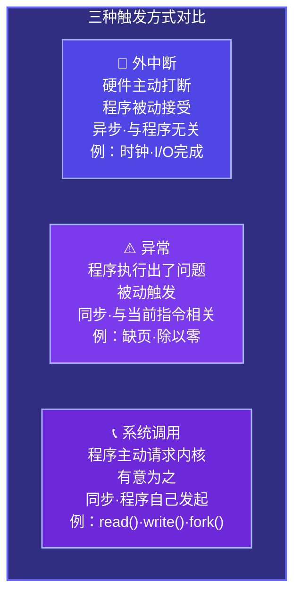

# 1.5 中断与异常

上一节我们讲到，CPU 在用户态和内核态之间来回切换，而触发这种切换的方式有三种：系统调用、中断、异常。这一节我们把**中断与异常**单独拿出来细讲。

为什么要单独讲？因为**中断机制是整个操作系统能够运转起来的基础设施**。没有中断，操作系统就没办法夺回 CPU 的控制权，进程调度、I/O 管理、时间片轮转……这些全都没法实现。可以说，中断是操作系统和硬件之间最重要的沟通渠道。

---

## 一、为什么需要中断——烽火台的故事

我们先想一个问题：操作系统是怎么"管住"正在运行的程序的？

一个程序跑起来之后，CPU 就一直在执行它的指令。如果这个程序是个死循环，或者它就是不肯交出 CPU，操作系统怎么办？

在回答这个问题之前，我想先讲一个两千多年前的故事。

周幽王有个宠妃叫褒姒，这个女人生得倾国倾城，却天生不爱笑。周幽王为了博她一笑，想尽了各种办法，始终无效。后来有个佞臣出了个主意：点燃骊山的烽火台。

烽火台是什么？是西周的**紧急通信系统**——边疆有敌人入侵，守将点燃烽火，临近的烽火台依次接力点燃，信号一路传到京城，各路诸侯看到烽火，立刻带兵勤王。

周幽王听从了这个建议，命人点燃了烽火。各路诸侯收到信号，紧急带兵赶来，结果发现什么都没有——只看见褒姒在城楼上看着乌泱泱赶来的军队，罕见地笑了。诸侯们面面相觑，悻悻而去。

几年后，犬戎真的入侵了。周幽王再次点燃烽火，诸侯们以为又是闹着玩，无一响应。周幽王死于乱军之中，西周就此灭亡。

---

这个故事里，烽火台就是一套**中断机制**。

烽火（中断信号）一旦点燃，诸侯（CPU）不管当时在干什么——吃饭也好、睡觉也好、打猎也好——都必须**立刻放下手头的事，跑来响应**。这不是靠自觉，是靠制度强制执行的。

操作系统里的中断机制也是同一个逻辑：操作系统在启动的时候，设置一个硬件时钟，让它每隔固定时间（比如 10ms）就产生一个**时钟中断**。不管 CPU 当时在跑什么程序，这个信号一来，硬件会强制把 CPU 切到内核态，跳去执行操作系统的中断处理程序。操作系统就趁这个机会检查：时间片用完了没有？有没有更高优先级的进程要运行？

**没有这个机制，操作系统就是周幽王最后的处境——想叫人来，但没有任何强制手段，只能眼睁睁看着程序死循环占着 CPU，什么都做不了。**

而"烽火戏诸侯"的教训，在操作系统里对应的就是**中断滥用**的后果——如果内核程序随意触发中断、随意修改中断向量表，整个系统的可靠性就会像西周的信用一样崩塌。所以特权指令的访问控制，本质上是在保护这套通信机制不被滥用。

---

## 二、中断的分类

中断分两大类：来自外部的叫**外中断**，来自 CPU 内部的叫**内中断（异常）**。

### 外中断（Interrupt）

来自 **CPU 外部**的信号，和当前正在执行的指令没有直接关系，是**异步**的——它什么时候来跟 CPU 在干什么没关系。

常见的外中断：
- **时钟中断**：硬件时钟定时产生，用于时间片轮转
- **I/O 中断**：磁盘读完了、网卡收到数据包了，设备通知 CPU 来取
- **外部信号中断**：键盘按下、鼠标点击

### 内中断（异常，Exception）

来自 **CPU 内部**，在执行当前指令的过程中产生，和当前指令**直接相关**，是**同步**的。

内中断细分三种：

| 类型 | 触发原因 | 能否恢复 | 典型例子 |
|------|----------|----------|----------|
| **故障 Fault** | 指令出了问题，但可以修复 | 能，修复后**重新执行该指令** | 缺页异常 |
| **陷阱 Trap** | 程序主动触发，请求内核服务 | 能，执行完后**继续下一条** | 系统调用 `syscall` |
| **终止 Abort** | 严重错误，无法恢复 | 不能，**进程直接终止** | 除以零、非法内存访问 |

---

## 三、三种异常——赤壁之战的三幕

Fault、Trap、Abort 这三个词放在一起有点干，我来讲个故事，一次性把三种情况说清楚。

地点：赤壁。时间：公元 208 年。

曹操率八十万大军南下，与孙刘联军隔江对峙。曹军多为北方旱鸭子，不习水战，将士在船上摇摇晃晃，苦不堪言。这时候，谋士庞统献上了"连环计"——用铁索把战船全部锁在一起，这样就不会颠簸了。曹操大喜，当即采纳。

**故障（Fault）——程序出了个可以修复的问题**

曹军的粮草账册由一个文书小官管理。这天他奉命去查一批粮草的记录，翻遍了手边的竹简，发现这批记录不在这里——它被存在后方大营的仓库里（类比：需要的数据不在内存，在磁盘上）。

小官没有慌乱，而是派人去后方把那捆竹简取来（类比：缺页中断处理——把数据从磁盘调入内存）。竹简送到之后，他**重新查阅了这批记录**，一切照常（类比：Fault 修复完成，重新执行刚才那条指令）。

整个过程，曹操根本不知道发生了什么，账目照常报上来了。这就是 **Fault**——出了个小问题，系统悄悄修好，然后**重新执行**出问题的那条指令，对上层透明。

**陷阱（Trap）——主动请求上级介入**

火攻之计需要东南风，而隆冬时节江面刮的是西北风。诸葛亮登坛借风，这个"借风"的过程其实是他主动发出的一个请求——我需要一种特殊资源（风向），我没有权限自己调配，我主动向更高的"系统"（天地）申请（类比：系统调用 `syscall`——程序主动陷入内核态，请求操作系统提供它没有权限自己完成的服务）。

借到风之后，诸葛亮该干嘛干嘛，继续指挥作战（类比：Trap 处理完毕，返回用户态，继续执行下一条指令）。

这就是 **Trap**——程序**主动**发起，有目的地请求内核帮它完成一件需要特权的事，完成之后**继续往下走**。

**终止（Abort）——无法挽回的致命错误**

曹操中了连环计，战船被铁索锁死。黄盖诈降，火船顺着东南风冲来。铁索连环的船队根本无法散开逃跑，烈火一烧，无可挽回（类比：发生了 Abort 级别的致命错误——不是某条指令出了小问题，而是整个运行环境已经崩溃，无法恢复）。

八十万大军就此溃败，曹操北归，此后再无南下之力（类比：进程直接终止，没有重试，没有继续，结束就是结束）。

这就是 **Abort**——严重到无法修复的错误，**没有任何恢复手段**，进程直接终止。

---

## 四、中断处理的过程

知道了中断是什么，再来看中断发生之后，硬件和操作系统是怎么一步一步处理的。

整个过程分两段：**硬件自动完成**的部分和**操作系统软件完成**的部分。

**阶段一：硬件自动完成（中断响应）**

1. CPU 执行完当前指令（或被强制打断）
2. **保存现场**：把当前程序的寄存器状态、程序计数器（PC）等压入栈里——就像诸侯出征前要先把手头的事交代清楚，留个"存档"，回来之后才能接着干
3. **切换到内核态**：修改 CPU 状态标志位
4. **查中断向量表**：根据中断号，找到对应处理程序的入口地址
5. **跳转执行**：CPU 跳转到中断处理程序

**阶段二：操作系统软件完成（中断处理）**

6. 进一步保存现场（如果硬件没保存完整）
7. 分析中断原因，执行对应处理逻辑
8. 恢复现场
9. 返回原程序（或者切换到另一个进程）

其中有一个关键数据结构：**中断向量表（Interrupt Vector Table）**。

它是一张"中断号 → 处理程序地址"的映射表，存放在内存的固定位置，系统启动时由操作系统初始化。CPU 收到中断信号，拿着中断号去这张表里一查，就知道该跳去哪里执行。

就像古代的驿站系统——朝廷下令，信使拿着令牌（中断号）去驿站查路线图（中断向量表），按图索骥奔赴对应的地方（跳转到处理程序）。

---

## 五、三种触发方式的本质区别

最后把外中断、异常、系统调用放在一起比一下，因为这三个东西经常被混着说：

三句话记住：
- 外中断——**硬件喊你**，跟当前程序无关，随时可能来
- 异常——**程序自己出了问题**，分能修和不能修两种
- 系统调用——**程序主动找你帮忙**，是 Trap 的一种特殊形式

---

## 总结

中断机制是操作系统能够"掌控全局"的根本手段。没有烽火台，周天子就叫不来诸侯；没有中断，操作系统就夺不回 CPU 的控制权。进程调度、I/O 管理、时间片轮转——这一切都建立在中断这个基础设施之上。

下一节（1.6 系统调用）我们把系统调用单独拿出来细讲——它是应用程序和操作系统之间最重要的接口，是 Trap 机制最直接的应用，也是你以后写系统程序时天天都会打交道的东西。