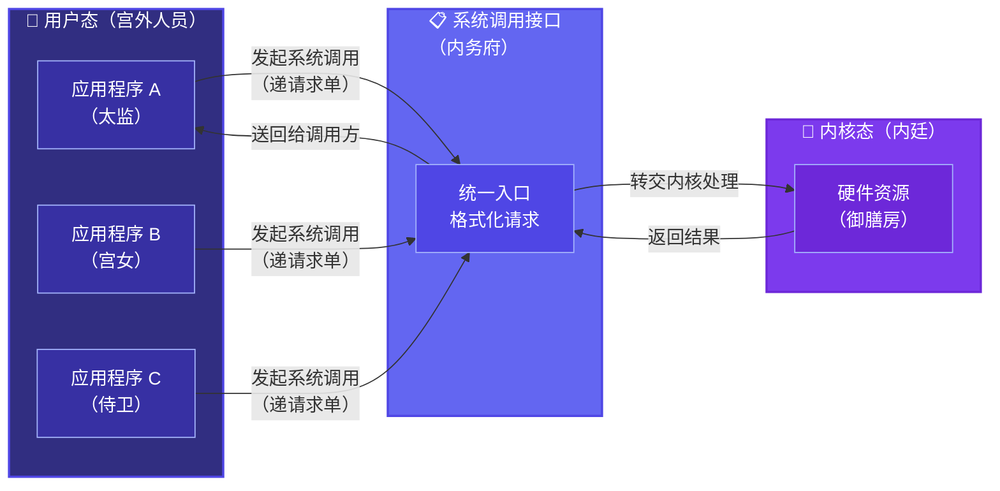
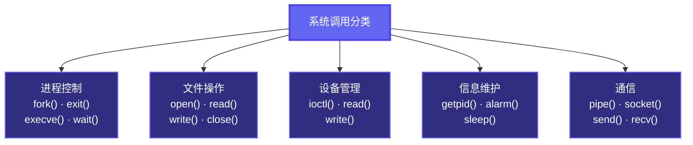
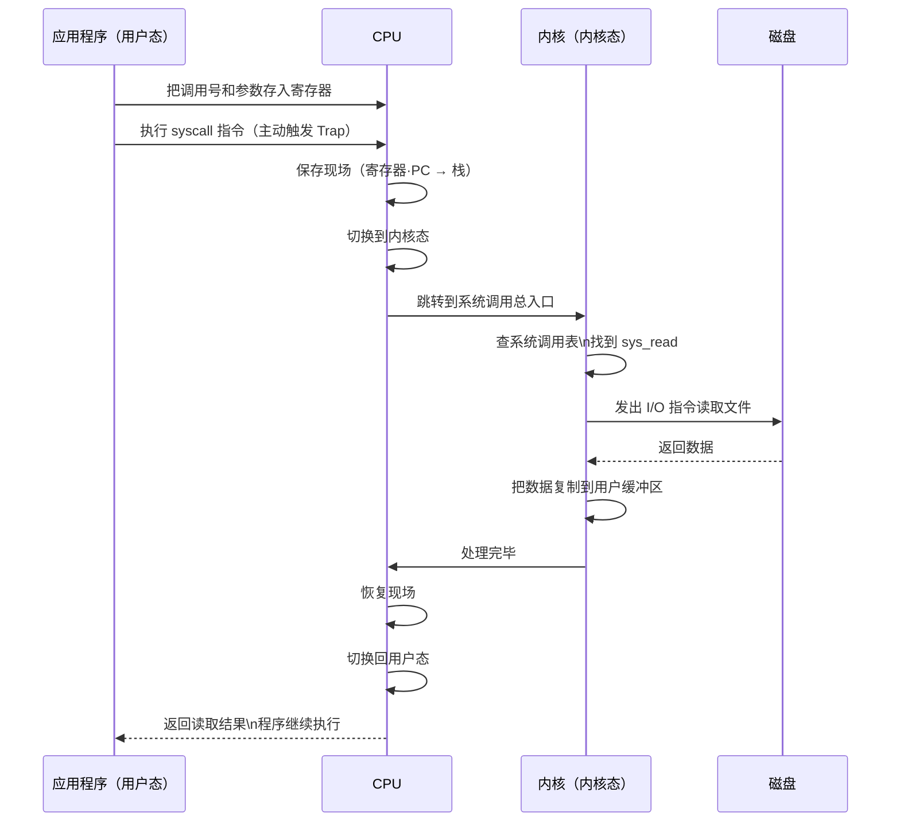
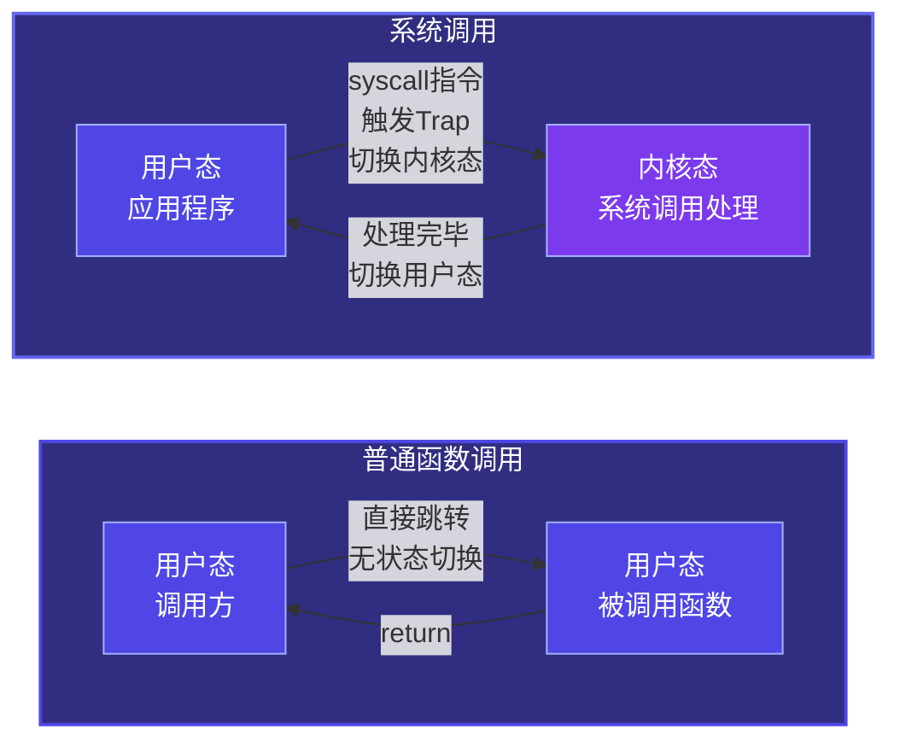
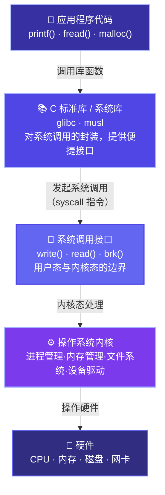

# 1.6 系统调用

上一节我们讲中断的时候，提到了一种特殊的内中断叫**陷阱（Trap）**，说它是"程序主动请求内核服务"的机制。这一节我们把这件事单独拿出来细讲，它有一个更正式的名字——**系统调用（System Call）**。

系统调用是应用程序和操作系统内核之间最重要的接口。你每天用的所有软件——微信、Chrome、VS Code——它们背后无时无刻不在发出系统调用。理解了系统调用，你才能真正明白一个程序是怎么"活"在操作系统里的。

---

## 一、为什么需要系统调用——御膳房的故事

大清王朝有一套非常严格的宫廷饮食制度。

皇帝（操作系统内核）住在紫禁城最深处，掌管着御膳房（硬件资源）——那里有最好的食材、最锋利的刀具、最大的灶台。御厨们（内核程序）在里面自由施展，想用什么用什么。

宫里的太监、宫女、侍卫（应用程序）每天也要吃饭，但他们没有资格直接闯进御膳房自己取食材、自己开灶——那是内廷禁地，私自闯入是要掉脑袋的（用户态程序不能直接执行特权指令，否则触发异常被终止）。

那他们怎么吃饭？

他们要通过一套固定的程序：在规定的地点、用规定的格式，向内务府（系统调用接口）递交一份请求单子（发起系统调用）。内务府收到请求，转交御膳房，御厨做好之后，再由内务府把食物送出来（内核处理完毕，返回结果）。

整个过程，太监们从来没有踏进御膳房半步，但他们确实吃到了御膳房做的饭。

这就是系统调用的本质：**应用程序没有权限直接操作硬件，但它可以通过系统调用，请求操作系统代劳。**

更关键的一点是：这套制度保证了御膳房的安全和秩序。如果谁都能冲进去，食材会被哄抢，灶台会被乱用，最后大家都吃不上饭。系统调用这个"单一入口"，是整个系统安全性的核心保障之一。



---

## 二、系统调用的分类

系统调用按照功能分成几大类，对应操作系统管理的不同资源：



你在 C 语言里用的 `printf()`、`scanf()`、`fopen()` 这些函数，并不是系统调用本身——它们是 C 标准库提供的封装函数，底层会帮你调用真正的系统调用（比如 `write()`、`read()`、`open()`）。库函数是对系统调用的再包装，用起来更方便，屏蔽了平台差异。

这就好比内务府对外还提供了一个"代写请求单"的服务——你不用知道请求单怎么写格式，告诉服务员你要什么，他帮你填好再递进去。

---

## 三、系统调用的执行过程——一次完整的旅程

一个系统调用从发起到返回，究竟经历了什么？我们以 `read()` 为例，把这个旅程完整走一遍。

假设你的程序要读一个文件里的内容：

```c
// 你在用户态写的代码
int fd = open("scores.txt", O_RDONLY);
read(fd, buffer, 1024);
```

这两行代码背后发生的事情，远比你看到的复杂：

**第一步：准备参数**

应用程序把系统调用号（每个系统调用都有一个编号，比如 Linux 的 `read` 是 0 号）和参数（文件描述符、缓冲区地址、读取长度）放进 CPU 的寄存器里。

**第二步：执行 `syscall` 指令**

这是关键的一步。程序执行一条特殊的机器指令（x86-64 上叫 `syscall`，老一点的叫 `int 0x80`），**主动触发一个陷阱（Trap）**，CPU 立刻：
- 切换到内核态
- 保存当前程序的执行现场（寄存器状态、程序计数器）
- 根据中断向量表，跳转到内核的系统调用总入口

**第三步：内核处理**

内核的系统调用总入口读取系统调用号，在**系统调用表**（一张"调用号 → 处理函数"的映射表）里找到 `sys_read` 函数，跳过去执行。

`sys_read` 在内核态完成真正的文件读取：检查权限、找到文件位置、发出磁盘 I/O 指令、等待数据就绪、把数据复制到用户缓冲区。

**第四步：返回用户态**

处理完毕，内核恢复之前保存的执行现场，切换回用户态，程序从 `read()` 调用的下一条语句继续执行，buffer 里已经有了读取到的内容。



---

## 四、系统调用 vs 普通函数调用

系统调用看起来很像普通的函数调用，都是"调用一个函数，传参数，拿结果"。但它们有一个本质区别：

**普通函数调用**不需要切换 CPU 状态，调用方和被调用方在同一个特权级别里（都在用户态），速度很快，开销极小。

**系统调用**需要完成一次完整的**用户态 → 内核态 → 用户态**的往返切换，还要保存和恢复现场，开销比普通函数调用大得多——大概要贵几百倍。



这就是为什么高性能程序员会尽量**减少系统调用的次数**——比如一次性读一大块数据而不是每次只读一个字节，本质上是在减少用户态和内核态之间切换的开销。

这也是为什么 C 标准库要做缓冲区的原因——`printf` 不是每次都立刻调用 `write` 系统调用，而是先把数据攒在缓冲区里，积累到一定量再一次性写出去，减少切换次数。

---

## 五、库函数、系统调用、内核的层次关系

我们最后把这几个概念的层次关系画清楚：



从上到下，权限越来越高，离硬件越来越近。你写的代码在最上面，硬件在最下面，系统调用是那条你必须经过的边界线——想往下走，只有这一扇门。

---

## 总结

系统调用是操作系统给应用程序开的一扇受控的门。没有这扇门，应用程序就是一座孤岛，什么也做不了；有了这扇门，应用程序可以请求操作系统代劳一切需要特权的操作，同时整个系统的安全性和稳定性也通过这扇门得到了保障。

到这里，第一章的六个小节就全部讲完了。我们从操作系统的概念和功能出发，讲了四大特征，讲了历史发展，讲了运行机制，讲了中断，讲了系统调用——这六节其实是一条完整的逻辑链：**操作系统是什么 → 它有什么特性 → 它怎么来的 → 它凭什么能管住程序 → 它怎么被打断和介入 → 程序怎么主动找它帮忙**。

后面从第二章开始，我们就要进入操作系统结构的具体实现了。