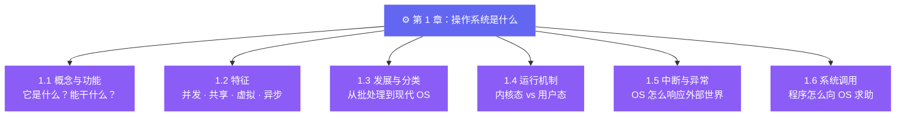

 
# 第 1 章：操作系统是什么
 
> 在你读完这一章之前，先读一个故事。
 
---
 
## 一个早上发生的事
 
早上七点，你按下电源键。
 
屏幕亮了。登录界面出现了。你输入密码，桌面加载出来，你打开浏览器，刷了一会儿新闻，顺手开了个音乐播放器，然后打开 VS Code 开始写代码。
 
这一切，你花了不到三十秒。
 
但在这三十秒里，你的电脑发生了什么？
 
CPU 被叫醒，开始执行指令。内存被分配给一个又一个程序。硬盘被读取，文件被找到，数据被加载。键盘的输入被捕获，屏幕的像素被刷新，声卡开始振动，网卡开始收发数据包……
 
这些事情，**没有一件是你亲自做的**。
 
有人替你做了。
 
这个"有人"，就是操作系统。
 
---
 
## 这一章在讲什么
 
这一章会回答一个问题：**操作系统到底是什么、怎么运作的？**
 
但这个问题不是一句话能说清楚的。所以我把它拆成了六个小问题，每个小节回答一个：
 

 
---
 
## 用那个早上的故事串一遍
 
回到早上那三十秒，把六个小节塞进去：
 
你按下电源键，CPU 通电，操作系统开始启动——**这就是 1.1 讲的：操作系统是夹在硬件和软件之间的那一层，负责管理资源、提供服务、扩展硬件能力。**
 
登录界面出现，你打开浏览器，同时开了音乐播放器，又打开了 VS Code——三个程序同时在跑。**这就是 1.2 讲的：并发。** 它们共享同一块 CPU 和内存，却互不干扰——**共享与虚拟**。你感觉它们都在"同时运行"，但 CPU 其实在飞速地在它们之间来回切换——**异步**。
 
你点击浏览器刷新，网卡突然收到了一个数据包——**这就是 1.5 讲的：中断。** 网卡对 CPU 发出一个信号："嘿，数据来了！"CPU 暂停手头的事，转头处理这个中断，处理完再回来继续。没有中断，操作系统就没法及时响应这个世界。
 
浏览器想播放一段视频，需要从硬盘读文件——它不能自己去读，只能向操作系统"申请"。**这就是 1.6 讲的：系统调用。** 应用程序通过系统调用向操作系统发出请求，操作系统审查请求是否合法，然后代劳去读硬盘。
 
而操作系统之所以能"审查"、能"代劳"，是因为它运行在一个特殊的权限层级里——**这就是 1.4 讲的：内核态与用户态。** 操作系统在内核态，可以执行任何指令；普通程序在用户态，碰不了硬件。
 
最后，你现在用的操作系统——无论是 Windows、macOS 还是 Linux——都是经过几十年演化才长成今天这个样子的。**这就是 1.3 讲的：操作系统的发展与分类。** 从最早的单道批处理，到分时系统，到实时系统，每一步演化都是为了解决上一代留下的问题。
 
---
 
## 读完这一章你会得到什么
 
不是"记住了几个名词"。
 
而是下次你按下电源键的时候，那三十秒里发生的事情，在你脑子里不再是一片空白——你知道有哪些角色在场，它们在做什么，为什么要这么做。
